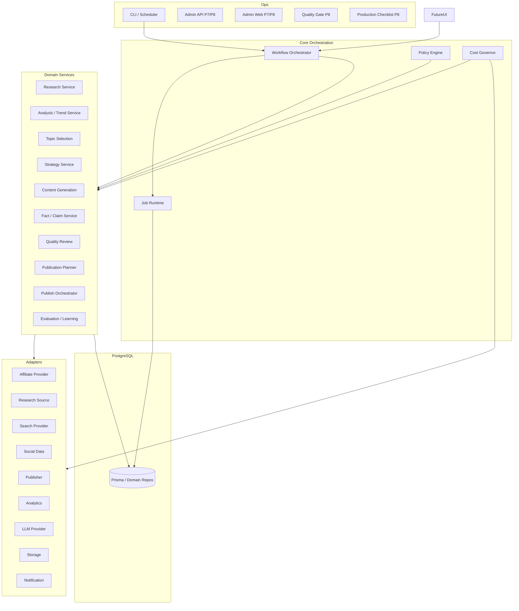
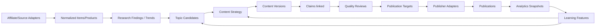
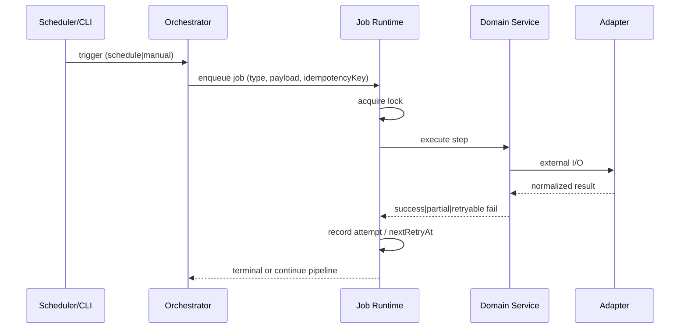
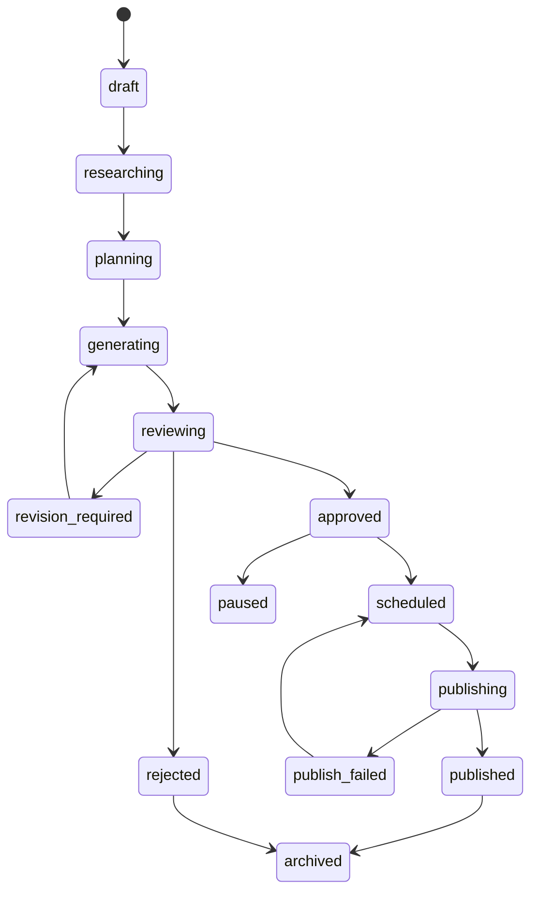
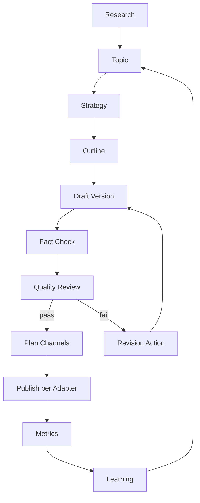

# AI Affiliate Factory — アーキテクチャ v1.0

**ステータス:** 実装前の推奨構成  
**関連:** `requirements-v1.0.md` / `data-model-v1.0.md` / `implementation-plan-v1.0.md` / `repository-audit.md`  
**既存補足文書:** `architecture.md`（実装済み Research〜X Live の現状説明。本書が目標構成）

---

## 1. 設計原則

1. **運営ライフサイクル中心** — 収集〜学習までをワークフローとして分離する。  
2. **境界のみ抽象化** — 差し替え頻度が高い Adapter に限定し、無意味な抽象を増やさない。  
3. **FANZA／X／Blogger 非固定** — 第一実装はそれらでも、コアはプロバイダ非依存。  
4. **根拠の永続化** — Claim／出典／ModelRun／Review を残す。  
5. **安全既定** — 自動公開・実 API・高額モデルは opt-in。  
6. **既存資産の漸進的移行** — ビッグバン書き換えを避け、Adapter 化とスキーマ拡張で吸収する。  
7. **過剰設計回避** — 初期は単一 deployable（`content-operator` 相当）＋ packages。マイクロサービス分割は必須としない。

---

## 2. システム構成（目標）



**現状との関係:** 既存 `apps/content-operator` が Core + 一部 Domain + FANZA/X Adapter を同居している。目標は責務のモジュール分割と Adapter 境界の明確化であり、即座のリポジトリ分割は必須ではない。

---

## 3. アプリ・パッケージ構成（推奨）

### 3.1 当面（P1/P2 反映後）

```
apps/
  content-operator/        # CLI + Scheduler + X/Research + lifecycle（旧 research-agent）
    adapters/              # Affiliate / Publisher / LLM / Analytics / ResearchSource / Notification
    lifecycle/             # Strategy / Claim / Content / Policy / Publication planning
    admin/                 # createAdminStack（CLI/Admin API 共用 Application wiring）
  admin-api/               # P7/P8: 内部管理 HTTP API（Hono）— /ready /production/checklist
  admin-web/               # P7/P8: Operations Console（Next.js）— Review / Export / Checklist
  e2e/                     # P8: Playwright browser E2E（Mock adapters only）
packages/
  shared/                  # DTO・logger・共通型
  config/                  # env（ADMIN_* 含む）
  database/                # Prisma・Repository（+ Lifecycle/P5/P6/AdminRepository）
  admin-contracts/         # P7: Admin API DTO / Role / Error codes（Prisma 非露出）
```

### 3.2 段階的に切り出す候補（必要になったら）

| パッケージ案 | 責務 |
| --- | --- |
| `packages/domain-content` | Content / Strategy / Claim の純ロジック |
| `packages/adapters-affiliate` | FANZA 他 ASP |
| `packages/adapters-publish` | X / Blogger / Mock |
| `packages/policy` | Policy Rule 評価 |
| `apps/worker` | ジョブ専用プロセス（負荷時） |

**仮定:** 初期は `content-operator` 内のディレクトリ境界（`affiliate/` `research/` `strategy/` `publish/` 等）で十分。パッケージ分割はコード量・依存循環が出た時点。

---

## 4. モジュール責務

| モジュール | 責務 | やってはいけないこと |
| --- | --- | --- |
| Research | 取得ジョブ、正規化、重複排除、鮮度 | 特定サイト HTML パースのコア混入 |
| Analysis / Trend | スコア、急上昇、ギャップ検出 | 固定「上位10件」前提 |
| Topic Selection | ネタ採用／却下と理由 | 形式 enum の無限分岐のみで拡張 |
| Strategy | 戦略オブジェクト作成・版管理 | LLM 1 コールに全責任 |
| Generation | 構成・初稿・版 | 公開 API 直接呼び出し |
| Fact / Claim | 事実登録・突合・信頼度 | 「AI が事実だと思った」だけの保存 |
| Review | 品質評価・違反検出 | 修正回数固定の単一ループ |
| Publication Planner | 公開先・承認・soft planning・CTA選択のオーケストレーション | 全媒体強制投稿・公式サイト最優先 |
| Link Resolver | リンク候補フィルタ／優先順位（preferred affiliate→product→future ASP→official→trusted→none） | 公式URL固定・無効/異商品混入 |
| Link Replacement | 公開後差し替えは新 Version／Target／Record（破壊的本文上書き禁止） | 公開本文の直接書換え |
| Publish Orchestrator | Adapter 呼び出し・冪等・部分失敗 | 媒体固有 API 詳細のコア混入 |
| Evaluation | 指標スナップショット・正規化スコア | いいね絶対値＝成功 |
| Policy | 規約・禁止・表記 | 規約全文のコード埋め込み |
| Cost Governor | 予算・モデル選択制約 | 全処理を最高額モデルへ |
| Job Runtime | 実行・再試行・ロック | HTTP 同期長時間処理 |

---

## 5. アダプター境界

差し替え可能性が高い境界のみ定義する。

| Adapter | 初期実装 | 将来 |
| --- | --- | --- |
| Affiliate Provider | FANZA（DMM API）/ Mock / Manual Import | 海外 ASP、フィード |
| Research Source | 商品 API（Affiliate と共有可）、Mock | 検索、競合ブログ、Reddit 等（規約準拠） |
| Search Provider | （未）スタブ可 | Google 等 |
| Social Data | X metrics（既存）/ Mock | 他 SNS |
| Publisher | X（既存 Live/Mock）/ **Blogger（Mock + API Draft）** / Mock | note, Threads, … |
| Analytics | Manual/CSV / Mock | GA, Search Console |
| LLM Provider | Mock / OpenAI-compatible（明示 `LLM_MODE=api`） | 複数モデルルーティング |
| Storage | DB + 将来オブジェクトストレージ | 画像原本は規約確認後 |
| Notification | Console / Webhook（既存） | Slack 等 |

### 5.1 Publisher 共通インターフェース（概念）

```typescript
// 概念スケッチ — 本フェーズでは実装しない
interface PublisherAdapter {
  readonly channel: string; // "x" | "blogger" | ...
  healthCheck(): Promise<boolean>;
  publish(request: NormalizedPublicationRequest): Promise<PublishResult>;
  fetchMetrics?(refs: ExternalRef[]): Promise<MetricSnapshot[]>;
}
```

既存 `XPublishingProvider` は本インターフェースの X 実装としてラップ／移行する。

### 5.2 Affiliate 正規化（概念）

内部は `AffiliateProduct` + `ProductSnapshot`（時点データ）。  
媒体固有 raw は `rawPayload` JSON に隔離し、コア判定は正規化フィールドのみ参照（既存 Content allowlist 方針を一般化）。

---

## 6. データフロー



---

## 7. ジョブフロー



**ジョブ種別（論理）:** research / analyze / strategize / generate / review / revise / publish / collect_metrics / sync_usage  

**製品選定（未確定）:**

| 案 | 長所 | 短所 |
| --- | --- | --- |
| A. 既存 DB Job + Schedule 拡張 | 追加インフラ不要、現行踏襲 | 高負荷・遅延ジョブに弱い |
| B. 同一 DB + 専用 worker プロセス | 分割容易 | デプロイ増 |
| C. Redis/BullMQ 等 | 本格キュー | 運用コスト・複雑性 |

**仮定 B（要件文書と同）:** 当面は案 A。パイプライン段階が増え SLA が必要になったら案 B→C。

---

## 8. 公開フロー



公開モード（コンテンツまたは `publication_target` 単位）:

- `AUTO`
- `CONDITIONAL_AUTO`（Policy / スコア / 予算条件）
- `HUMAN_APPROVAL`
- `DRAFT_ONLY`

**X 特有:** 既存の release mode / kill switch / PrePublishGuard / budget を Publisher 層のガードとして維持。  
**Blogger:** 同様に draft→公開 API、表記・画像規約チェックを Publisher 前段で実施。

---

## 9. 評価・学習フロー

1. 公開後、channel ごとの collection window で metrics 取得（欠損は null）。  
2. アフィリエイト成果は日付・商品・ASP 単位を基本とし、投稿への紐付けは **弱い関連**（campaign / content_id 任意）。  
3. Feature store 相当は DB 上のスナップショット＋集計ビューで開始（別 ML 基盤は必須としない）。  
4. 次回 Topic / Strategy / Prompt 選択時に成功・失敗パターンを参照。  
5. 正規化例（概念）: `engagement / impressions`、`clicks / impressions`、アカウントフォロワー帯でバケット化。

モデル重みのオンライン学習は行わない。運用データ蓄積＋ルール／プロンプト更新が主。

---

## 10. リサーチ探索の動的終了

固定件数の代わりに終了条件（組み合わせ可）:

- 新規 finding の増加が停滞  
- 重複率閾値超過  
- 信頼度／カバレッジ充足  
- コスト上限  
- 実行時間上限  
- オペレータによる cancel  

---

## 11. エラー処理

| 種別 | 方針 |
| --- | --- |
| 一時的ネットワーク / 429 | 指数バックオフ再試行。write は冪等キー優先 |
| 認証失敗 | Credential 状態更新、再認証通知、当該 Adapter 停止 |
| 規約・Policy 違反 | `rejected` / `paused`。無限 retry しない |
| 部分公開失敗 | 媒体単位で failed、他媒体は維持。再送は明示 |
| 予算超過 | 有料呼び出し停止、診断・DB・Mock は継続 |

---

## 12. コスト管理

追跡: モデル、入出力トークン、リサーチ取得、API、画像、公開、コンテンツ単位合計、日次／月次、予算、異常検知。  

ルーティング例:

- 構成・分類: 安価モデル  
- 初稿: 中位  
- 最終レビュー・高リスク: 必要時のみ高位  
- Mock: ゼロコスト経路  

既存 X API budget の考え方を LLM／Research にも一般化する。

---

## 13. セキュリティ

- OAuth token 暗号化（既存 X Live パターンを他 Publisher へ再利用可）  
- 秘密情報のログ禁止  
- 監査ログ  
- 最小権限の API キー  
- 成人向けデータのアクセス制御（将来 Admin で必須）  
- SSRF 対策（Webhook / fetch URL allowlist）  

---

## 14. 拡張方法

1. **新 ASP:** `AffiliateProvider` 実装 → 正規化マッピング → Source 登録。コア変更なし。  
2. **新公開先:** `PublisherAdapter` 実装 → `publication_targets.channel` 追加 → Policy ルール追加。  
3. **新情報源:** Source Adapter + 取得コスト／規約メタデータ。  
4. **新 Content Type:** 戦略テンプレート＋生成プロンプト＋検証ルール。enum は「処理制御に必要な最低限」のみ追加し、細部は strategy JSON。  
5. **SEO ルール:** Policy / 設定パッケージとして import。  

---

## 15. コンテンツライフサイクル（要約図）



---

## 16. 既存実装の位置づけ

| 既存 | 目標構成での位置 |
| --- | --- |
| FANZA Provider / Jobs / Schedules | Affiliate + Research の第一実装 |
| Analysis Engine | Analysis の初期実装（商品スコア中心。Trend 探索は拡張） |
| Content Engine | Generation + Review の初期実装（Claim 永続は不足） |
| X Publication / Ops / Live / Optimization | X Publisher + 学習の高度な先行実装 |
| Notifications | Notification Adapter |
| Blogger | **Mock Draft 実装済み**。**P4.5** で API Publisher（下書き中心、direct publish 既定オフ）を追加。OAuth／認証は明示設定時のみ |
| LLM | **P4.5** Mock／API。PromptDefinition 正本。ModelRun／Cost 記録。API キー非永続 |
| 汎用 Strategy / Claim / Multi-publisher planner | **P1〜P4.5 で追加済み** |

---

## 17. 改訂

| 版 | 内容 |
| --- | --- |
| v1.0 | 初版 |
