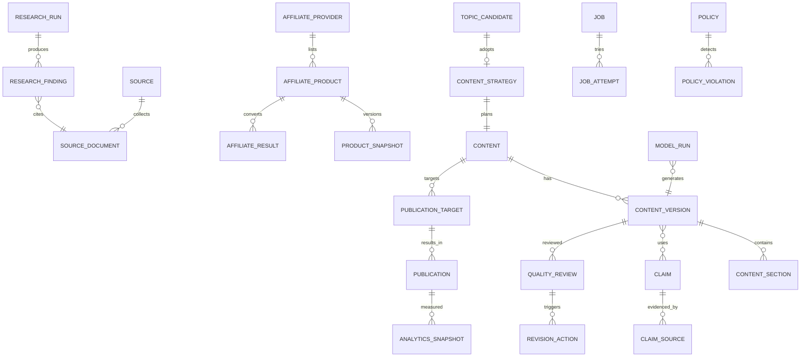
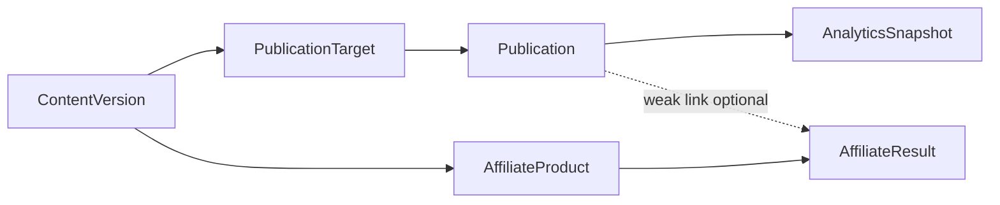

# AI Affiliate Factory — データモデル v1.0

**関連:** `requirements-v1.0.md` / `architecture-v1.0.md` / 既存 `packages/database/prisma/schema.prisma`  
**方針:** JSON 全載せを避けつつ、AI 出力・媒体固有は JSON 可。名称は提案であり、実装時に既存モデルへマッピング／拡張する。

---

## 1. 概念ドメイン

---

## 2. 必要エンティティ（論理）と既存対応

| 論理エンティティ | 役割 | 既存対応 | 差分方針 |
| --- | --- | --- | --- |
| AffiliateProvider | ASP 定義 | `ResearchSource`（部分） | `providerKey`, capabilities（api/feed/manual/scrape）, 規約メタを明示 |
| AffiliateProduct | 正規化商品 | `ResearchItem` | 商品ドメインを分離するか、ResearchItem を「観測アイテム」に一般化し product リンク |
| ProductSnapshot | 時点価格・在庫・説明 | `ResearchMetric` + rawData | スナップショット表 or metrics 継続＋商品FK |
| Source | 情報源マスタ | `ResearchSource` | channel を fanza/x/tiktok 以外へ拡張 |
| SourceDocument | 取得文書 | （なし） | **新規**（URL、取得日時、許可範囲、hash） |
| ResearchRun | 探索実行 | `ResearchJob` / `AnalysisRun` | 探索専用 run を追加または JobType 拡張 |
| ResearchFinding | 知見 | （なし） | **新規** |
| Trend | トレンド集約 | （なし／Analysis 派生） | **新規**または Materialized 集計 |
| TopicCandidate | ネタ候補 | `ContentCandidate` | 採用理由・却下理由・形式ヒントを強化 |
| ContentStrategy | 戦略 | （なし） | **新規**（版管理） |
| Content | コンテンツ集約 | `GeneratedContent` 親相当 | ライフサイクル状態を集約 |
| ContentVersion | 版 | `GeneratedContent` | 版番号・親戦略・モデル run 関連 |
| ContentSection | 章・投稿単位 | X posts / blog sections | XPublicationPost と統合可能な抽象 |
| Claim | 事実主張 | 検証ロジックのみ | **新規** |
| ClaimSource | 出典リンク | （なし） | **新規** |
| CompetitorContent / Analysis | 競合 | （なし） | **新規**（初期は finding JSON でも可） |
| QualityReview | 品質評価 | `ContentValidationIssue` + `ContentReview` | スコア付きレビュー実行履歴を追加 |
| RevisionAction | 修正方針 | （なし） | **新規** |
| PublicationTarget | 公開先計画 | `ContentTargetChannel` フィールド | **新規**（channel, mode, schedule） |
| PublicationJob | 公開ジョブ | XPublication + ResearchJob | 媒体横断の公開ジョブ |
| Publication | 公開結果 | `XPublication` / Post | channel 汎用化＋X 詳細は子 |
| AnalyticsSnapshot | 指標 | `XPostMetricSnapshot` | channel 汎用スナップショット |
| AffiliateClick / Result | 成果 | （なし） | **新規**（手動／CSV 初期） |
| Prompt | プロンプト版 | コード内 | **新規**または設定 |
| ModelRun / ModelCost | LLM 実行 | （なし） | **新規** |
| Job / JobAttempt | 汎用ジョブ | `ResearchJob` / Error | タイプ拡張または汎用 Job へ進化 |
| Policy / PolicyViolation | 規約 | コード＋X Guard | **新規**ルール表 |
| Configuration | 運用設定 | env + RuntimeControl | DB 設定の段階導入 |
| AuditLog | 監査 | `XOperationalAuditLog` | システム横断へ一般化 |

---

## 3. 主要フィールド指針

### 3.1 AffiliateProduct（正規化）

- `providerKey`, `externalProductId`, `title`, `url`, `affiliateUrl`（アクセス制御付き）  
- `adultFlag`, `locale`, `currency`, `images[]`（利用条件ステータス必須）  
- `attributes` JSON（actress/genre 等は FANZA 固有として隔離可）  
- 関連: `ProductLink[]`（CTA 候補。公式サイトより Provider 通常ページを優先）

### 3.1b ProductLink / ProductLinkUsage / LinkReplacementEvent

`ProductLink` は商品カタログ上の候補リンク（商品との関連）。使用箇所は `ProductLinkUsage` で分離する。

**ProductLink**

- `preferredAffiliateProvider`（既定 `fanza`。Registry の FANZA adult。DMM通販とは別 providerKey）  
- `currentLinkProvider` / `currentLinkType` / `replacePriority` / `productMatchKey` / `availability`  
- 差し替え状態: `replacementStatus`, `candidateAffiliateUrl`, `candidateAffiliateProductId`, `matchedProvider`, `matchConfidence`, `matchReason`, `detectedAt`, `approvedAt`, `approvedBy`, `replacedAt`, `rejectionReason`

**優先順位:** preferred affiliate → preferred product → future ASP affiliate → future ASP product → official → trusted → none

**ProductLinkUsage:** `contentVersionId` / `publicationTargetId` / `publicationRecordId` / `usageKind`(CTA|BODY|METADATA) / `locationHint`

**LinkReplacementEvent:** 公開済み本文を破壊せず、候補→承認→新 ContentVersion→新/更新 Target→PublicationRecord 更新履歴（旧URL/新URL/理由/承認者/日時）

### 3.2 Claim / ClaimSource

- Claim: `statement`, `kind`（FACT / OPINION / CLAIM_UNVERIFIED / OFFICIAL）, `confidence`, `freshUntil`, `status`  
- ClaimSource: `url` or `sourceDocumentId`, `retrievedAt`, `publishedAt?`, `quoteOrSummary`, `isOfficial`, `agreementGroupId`  

### 3.3 ContentStrategy

- 要件 FR-04 の項目を列または JSON Schema 付き JSON で保持  
- `version`, `contentId`, `createdBy`（system/user）, `modelRunId?`  

### 3.4 Content 状態

論理状態（要件）:

`draft` / `researching` / `planning` / `generating` / `reviewing` / `revision_required` / `approved` / `scheduled` / `publishing` / `published` / `publish_failed` / `paused` / `rejected` / `archived`

既存 `GeneratedContentStatus` / `XPublicationStatus` とのマッピングは移行期に二層（集約状態＋媒体状態）で持つ。

### 3.5 PublicationTarget

- `channel`（blogger / x / …）  
- `publishMode`（AUTO / CONDITIONAL_AUTO / HUMAN_APPROVAL / DRAFT_ONLY）  
- `scheduledAt`, `priority`, `policyProfileId`  

### 3.6 AnalyticsSnapshot

- `channel`, `externalId`, `measuredAt`, `metrics`（既知カラム＋ JSON 拡張）  
- 欠損は null。0 埋めしない（既存 X metrics 方針を踏襲）。  

### 3.7 ModelRun / Cost

- provider, model, inputTokens, outputTokens, estimatedCost, purpose（outline/draft/review/…）, latencyMs, promptVersion  

---

## 4. リレーション要約

- TopicCandidate 1 — 0..1 ContentStrategy — 1 Content — N ContentVersion  
- ContentVersion N — M Claim（使用事実）  
- Content 1 — N PublicationTarget — N Publication  
- Publication 1 — N AnalyticsSnapshot  
- AffiliateProduct 1 — N AffiliateResult（日付・ASP 単位、Publication へは任意 FK）  
- Job は上記どの集約にも `subjectType` + `subjectId` でポリモーフィック関連（または明示 FK）  

---

## 5. 状態管理

| 対象 | 状態の置き場 |
| --- | --- |
| コンテンツ運営 | Content.status（集約） |
| 版 | ContentVersion.status（draft/reviewed/rejected） |
| 媒体公開 | Publication.status（既存 X 詳細を包含） |
| 認証 | Credential.status（既存 XApiCredential） |
| 予算 | BudgetControl.status（既存＋一般化） |
| ジョブ | Job.status + attempts |

状態遷移はアプリケーションサービスが単一入口で行い、勝手な直接更新を避ける。

---

## 6. バージョン管理

- ContentVersion: 不変保存（修正は新版）。  
- Strategy: 版を積み、採用版を Content が参照。  
- Prompt: 版管理し ModelRun が参照。  
- ProductSnapshot: 価格・情報の時点復元。  

---

## 7. 出典と事実

- 生成入力は Claim ID の集合を優先し、自由テキストの「それっぽい事実」を減らす。  
- 既存 Content Validator の `FABRICATED_FACT` / `UNSUPPORTED_CLAIM` は、Claim グラフ接続後も維持。  
- 単一ソースのみの Claim は低信頼度とし、自動公開条件から除外可能にする。  

---

## 8. 投稿と分析結果

- X 投稿指標: 既存 `XPostMetricSnapshot` を Analytics の特殊化として継続可。  
- 成果: 投稿 ID 必須としない。`contentId` / `productId` / `date` / `utm` で弱い結合。  

---

## 9. 既存 Prisma Schema との差分案（段階）

### Phase DM-1（非破壊・追加中心）— **適用済み（P1/P2）**

- `Content` / `ContentVersion`（GeneratedContent から backfill、legacy 行は維持）  
- `ContentStrategy` / `TopicCandidate`  
- `Claim` / `ClaimSource` / `ContentVersionClaim`  
- `SourceDocument` / `ResearchFinding`  
- `PublicationTarget` / `PublicationRecord`  
- `ModelRun` / `CostRecord` / `BudgetSetting`  
- `PolicyRule` / `PolicyEvaluation`  
- `QualityReviewRecord` / `RevisionAction`  
- `AffiliateProviderRegistry` / `AffiliateProduct`  
- `OperatorJob`  
- 詳細: `docs/migration-p1-p2.md`  

### Phase DM-2（X／Blog 横断）— **一部適用済み（P3/P4 + P4.5）**

- `AnalyticsSnapshot` / `Content.monetizationStatus`（P3/P4）  
- `PromptDefinition` 拡張（systemInstruction / inputTemplate / outputSchema / enabled / effectiveFrom）（P4.5）  
- 認証情報は Prisma に保存しない（env のみ）  

### Phase DM-2.5（評価・学習）— **適用済み（P5）**

- `AnalyticsAggregate`  
- `Evaluation` / `EvaluationFinding`  
- `Experiment` / `ExperimentVariant` / `ExperimentResult`  
- `LearningRule` / `StrategyFeedback`  

### Phase DM-3（Research 深化）

- `SourceDocument`, `ResearchFinding`, `Trend`  
- ResearchJobType に explore / competitor 等  

### 互換方針

- 既存テーブル削除は最終手段。  
- 読み取りは Repository で旧モデルをラップ。  
- 移行スクリプトと双方向同期期間を設ける。  

---

## 10. JSON の使いどころ

| 使う | 使わない（列または正規化） |
| --- | --- |
| LLM 生出力、媒体固有レスポンス | 公開状態、外部投稿 ID、コスト金額 |
| 戦略の拡張フィールド | アカウント ID、channel |
| 競合分析の生抽出 | 必須 Claim の statement / URL |
| Feature ベクトル実験 | 監査 actor / action |

---

## 11. P7 Admin Console モデル

| Model | 用途 |
| --- | --- |
| AdminUser | 内部ユーザー（passwordHash のみ。平文禁止） |
| AdminSession | opaque session token の sha256 |
| SystemSetting | 非秘密の運用設定 |
| ProviderMappingProfile | Affiliate Result CSV mapping（isSample で仮 profile 明示） |
| ApprovalDecision | 承認決定の明示記録（AuditEvent を補完） |
| FileUploadReference | アップロード参照（raw 本文は既定非保存） |

API レスポンスは Prisma model をそのまま使わず `packages/admin-contracts` の DTO を使う。

---

## 12. 改訂

| 版 | 内容 |
| --- | --- |
| v1.0 | 初版 |
| v1.0+P7 | AdminUser / Session / Settings / MappingProfile 等 |
| v1.0+P8 | モデル追加なし（BudgetScope PER_* / Quality Gate は ReviewFinding に格納）。運用モードは設定 |
