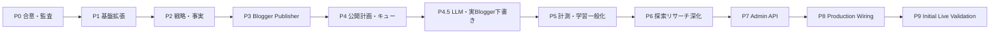

# AI Affiliate Factory — 実装計画 v1.0

**関連:** `requirements-v1.0.md` / `architecture-v1.0.md` / `data-model-v1.0.md` / `repository-audit.md`  
**前提:** 本ドキュメント作成時点では大規模実装を開始しない。合意後にフェーズ順で進める。

---

## 1. フェーズ分割概要



| Phase | 目的 | 主な完了条件 |
| --- | --- | --- |
| **P0** | 要件・設計合意 | 本シリーズ文書レビュー、未確定事項の優先回答 |
| **P1** | 壊さない基盤 | **実装済み（2026-07）** Adapter・Policy・ModelRun・Cost・OperatorJob・アプリ改名 |
| **P2** | 戦略・事実 | **実装済み（2026-07）** Strategy / Claim / Content+ContentVersion / PublicationTarget Mock |
| **P3** | Blogger | **実装済み（2026-07）** **Mock 運用基盤** — Mock Draft／SEO メタ、手動商品・非APIリサーチ、rule-based 記事生成 |
| **P4** | 公開オーケストレーション | **実装済み（2026-07）** **Mock 運用基盤** — 双ターゲット、承認、Queue、X Export、手動 Analytics、未収益化、リンク差し替え |
| **P4.5** | 本番生成・下書き | **実装済み（2026-07）** PromptDefinition 接続・Mock/API LLM・Claim/Quality Review・Revision・実 Blogger Draft（明示設定時） |
| **P5** | 評価・実験・学習 | **実装済み（2026-07）** AnalyticsAggregate・Evaluation・Experiment・LearningRule・StrategyFeedback |
| **P6** | Analytics運用・学習統治・Orchestration | **実装済み（2026-07）** Import/Attribution・Learning governance・OperationJob/checkpoint・Audit |
| **P7** | 管理面 | **実装済み（2026-07）** Admin API + Admin Web（Role認可・承認操作・Audit）。CLI 維持 |
| **P8** | 本番配線 | **実装済み（2026-08）** 実LLM/Blogger準備・Quality Gate・ASSISTED・E2E・Docker・Budget |
| **P9** | 初回ライブ検証 | **実装済み（2026-08）** 公開URL Research・Runbook・Review再利用・Mock ID一意化 |

---

## 2. 各フェーズ詳細

### P0 — 合意（実装なし）

**対象:** ドキュメント、優先未確定事項の決定  
**非対象:** コード変更（本フェーズ）  
**完了条件:** 人間レビューで「実装開始してよいフェーズ」が明示される  

### P1 — 基盤拡張（低リスク）

**目的:** 後から構成変更が起きないよう境界を先に置く。  

**実装対象:**

- `PublisherAdapter` / `AffiliateProvider` インターフェースの導入と既存 X／FANZA の薄いラップ  
- `Policy` テーブル or 設定ファイル骨格＋評価フック（既存 Guard から段階移行）  
- `ModelRun` / 簡易コスト記録（Mock でも 0 円で記録）  
- Content 集約状態のマッピング設計（コード定数＋ドキュメント）  
- channel 型の拡張余地（shared types）  

**非対象:** Blogger 実投稿、大規模スキーマ破壊  

**依存:** P0  
**テスト:** 既存スイート維持＋ Adapter ラップの単体  

### P2 — 戦略・事実

**実装対象:**

- `ContentStrategy` CRUD  
- `Claim` / `ClaimSource` / 版との関連  
- ContentEngine が allowlist だけでなく Claim ID を入力に含める  
- RevisionAction の記録（最大回数固定ではなく停止条件）  

**非対象:** 自動競合クローラ本格化  

**完了条件:** Mock 商品から Strategy→Draft→Fact-linked Review まで CLI で再現  

### P3 — Blogger Publisher

**実装対象:**

- BloggerPublisher（Mock 必須、実 API は認証後）  
- 記事メタ（title, description, labels, canonical 候補）  
- アフィリエイト表記・画像利用 Policy  
- 公開結果の Publication 記録  

**非対象:** 高度 SEO 自動戦略  

**完了条件:** Mock で公開フロー完走。実 API は承認後に別チェックリスト  

### P4 — 公開計画・キュー

**実装対象:**

- PublicationTarget（X / Blogger）  
- 承認モード  
- 日次 1〜2 目安のキュー制御（ハード／ソフトは設定）  
- X 本文 140 字＋必要時のみ返信、の戦略テンプレ連携  
- Blogger↔X 導線型コンテンツのターゲット組  

**依存:** P2, P3、既存 X Live／Ops  
**完了条件:** 同一 Content から「Blogger のみ／X のみ／両方／なし」を選択可能  

### P4.5 — 本番 LLM 生成・実 Blogger 下書き

**実装対象:**

- LLM Provider（Mock / OpenAI-compatible API）明示切替  
- PromptDefinition 接続（生成・レビュー・修正）  
- 構造化 ContentVersion → Claim/Policy/Quality Review → 人間承認 → Blogger HTML → createDraft  
- Blogger API Publisher（draft 既定、direct publish 既定オフ）  
- OAuth 補助 CLI（secret 非ログ）  
- X LLM 生成＋決定論バリデーション＋Export  

**非対象:** Affiliate API、X 自動投稿、完全自動公開、管理画面  

**完了条件:** Mock 縦切り＋認証あり環境での明示下書き。自動テストは実 API 非接続  

### P5 — Evaluation / Experiment / Learning

**実装対象:**

- AnalyticsSnapshot → AnalyticsAggregate（共通指標正規化）  
- Evaluation（決定論 → 任意 LLM）  
- Experiment（人間承認必須・自動公開禁止）  
- LearningRule（confidence / sampleCount）  
- StrategyFeedback（次回 Strategy のみ）  

**非対象:** 記事の自動書き換え、Affiliate API、管理画面、完全自動公開  

**完了条件:** Mock 縦切りで Aggregate→Evaluation→Experiment→Learning→Strategy Feedback  

### P6 — Production Analytics / Learning Governance / Orchestration

**実装対象:**

- Analytics CSV/JSON import + Attribution  
- AffiliateResult 将来境界（収益指標分離）  
- LearningRule 昇格・停止・競合検出  
- strategy.assist への ACTIVE Rule 構造化注入 + LearningRuleApplication  
- OperationJob / checkpoint / resume / Audit  

**非対象:** 実 FANZA API、X 自動投稿、完全自動公開、管理画面  

**完了条件:** Mock 縦切りで import→governance→strategy injection→resume  

### P7 — Admin API / Operations Console

**実装対象（完了）:** Admin API（認証・RBAC・DTO）+ Admin Web（承認／Import／Job／Audit）  
**維持:** CLI と同一 Application Service。秘密情報非露出。Mock 縦切り `pnpm p7:vertical`  

---

## 3. 最初に実装すべき縦切り（MVP Thin Slice）

**ゴール:** API 未承認でも、収益運営の最小ループをデモできる。

```text
Manual/Mock 商品投入
  → TopicCandidate 採用
  → ContentStrategy 作成（人手 or Mock LLM）
  → Draft（既存 ContentEngine）
  → Claim 2件以上紐付け
  → Review 合格
  → PublicationTarget: X=Mock publish / Blogger=Mock draft
  → Analytics 手動入力 1 件
  → 次回 Topic に実績参照（簡易）
```

これが通ってから実 FANZA／実 X／実 Blogger を接続する。

---

## 4. 依存関係

| 成果 | 依存 |
| --- | --- |
| 実 FANZA 収集 | ASP 承認、DMM 資格情報 |
| 実 X 投稿 | Developer App、OAuth、ALLOWLIST 手順（既存 README） |
| 実 Blogger | Google Cloud / Blogger API 認証（未確定） |
| 有料 metrics | 予算合意 |
| Admin UI | P7 API |

---

## 5. テスト方針

- 既定: Vitest + DB fixture + Mock HTTP（実外部 API 禁止）  
- 新規 Adapter は契約テスト（正規化スキーマへのマッピング）  
- Policy / Claim は表形式ケース  
- 公開冪等・部分失敗の回帰  
- 既存 168 前後のテストを破壊しない（追加のみ）  
- CI: 現行 GitHub Actions 維持  

---

## 6. 移行方針

1. **拡張優先** — 新テーブル追加、旧テーブル当面残す  
2. **書き込み dual-write** — 汎用 Publication 導入時  
3. **読み取り切替** — Repository ファサード  
4. **旧カラム非推奨化** — ドキュメント＋ lint ルール  
5. **削除** — データ移行完了後の別リリース  

FANZA 前提の `productKey` provider 文字列は、ResearchSource／AffiliateProvider から解決するよう段階修正。

---

## 7. リスク

| リスク | 影響 | 緩和 |
| --- | --- | --- |
| ASP 非承認 | 商品自動取得不可 | Mock／手動を第一級市民に |
| X／Blogger 規約変更 | 公開停止 | Policy 外生化、kill switch |
| 抽象過多 | 速度低下 | Adapter 数を実需に限定 |
| スキーマ肥大 | 移行困難 | フェーズ分割、JSON 乱用禁止 |
| コスト爆発 | 運営不可 | Cost Governor、安価モデル既定 |
| 既存 X 高度実装との二重管理 | バグ | X を Publisher 実装としてラップし二重ロジック禁止 |

---

## 8. フェーズ完了の共通定義

各フェーズ終了時:

1. ドキュメント更新（差分）  
2. `pnpm lint && pnpm build && pnpm test` 緑  
3. README に「できること／まだできないこと」を追記  
4. 実 API 未検証を成功と書かない  

---

## 9. 推奨スケジュール感（仮定）

**仮定:** ソロまたは少人数。カレンダー拘束力なし。

| Phase | 目安 |
| --- | --- |
| P1 | 1〜2 週間 |
| P2 | 2〜3 週間 |
| P3 | 2〜4 週間（API 待ち含む） |
| P4 | 2〜3 週間 |
| P5 | 2 週間 |
| P6 | 継続的 |
| P7 | 需要次第 |

---

## 10. 改訂

| 版 | 内容 |
| --- | --- |
| v1.0 | 初版 |
